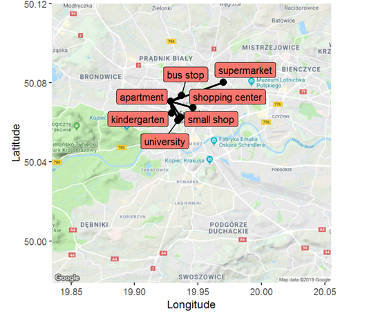
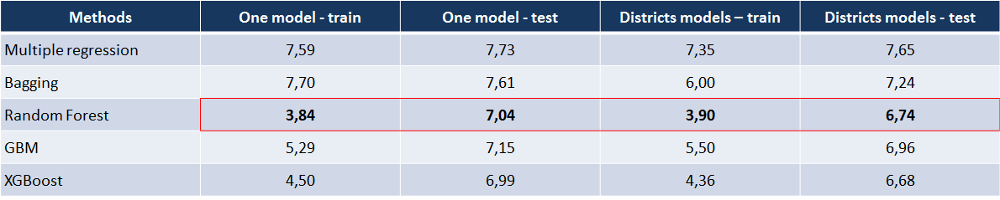
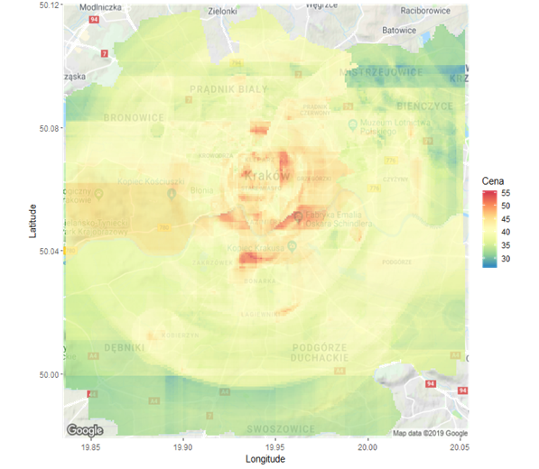

# Forecasting Rental Prices in Cracow

After the data was collected to my undergraduated thesis I realized that there is a possibility to check how location affects rental price of apartment. In the next step informations about objects and areas surrounding the dwellings were extracted from google API and OpenSteetMaps. All these informations made it possible to carry out the study on the most accurate forecasting rental prices using spatial variables and the distances between apartments and selected objects.

<p align="center">

</p>

## Data

Due to not enough observations in some of 18 Cracow districts I decided to take into account four main delegations: Krowodrza, Śródmieście, Nowa Huta and Podgórze. The study used two and three room flats with less than 80 square meters and these where we have to pay less than 60 PLN per square meter.

From the objects surrounding the apartments, the following have been taken into account: "university", "shopping center", "kindergarten", "small shop", "bus stop", "supermarket", "city center", "park". Based on their coordinates, the distance from the nearest facility of each type was calculated and the average distance to the nearest five representatives of each type except for the "city centre" and the "park". Also, due to the significantly higher number of students at universities such as "AGH University of Science and Technology" and "Jagiellonian University", a weight was imposed on the distance between the apartment and the university building. The formula for the weights is:
```math
(1 - number of students at university / number of students in Cracow) * distance to university building
```

## Models

Two approaches to prediction were used in the study, in the first case only one model was created based on all observations.  In the second case, separate models were created for each of the districts, based on observations located only in these districts and then predictions were combined. Methods used to create models are:

- **Multiple Regression** - the best model was selected using Akaike Information Criterion.
- **Bagging**
- **GBM**
- **Random Forest**
- **XGBoost**

## Conclusions

The best results were obtained by the Random Forest method, but the XGBoost models did not achieve much worse results. In case of error checking on the test data better result was achived by separated models approach. But when result was checked on the test data, one model has proved to be more effective. Below you can see errors expressed in PLN and how predicted values are shown on maps.

<p align="center">

 


</p>

## Main libraries

- **randomForest**, **pracma**, **gbm**, **e1071**, **xgboost**, **caret**, **MLmetrics**- Machine Learning

- **ggmap**, **osmdata**, **geosphere**, **googleway**, **gmapsdistance** - Coordinates of objects

- **rvest**, **rlang**, **RCurl** - Webscrapping

- **tidyverse**, **dbplyr**, **dplyr**, **XML**, **stringr**, **caTools** - Generally useful libraries

## Contributors

- **Mateusz Jałocha** (mat.jalocha@gmail.com, https://www.linkedin.com/in/mateusz-jalocha/)

